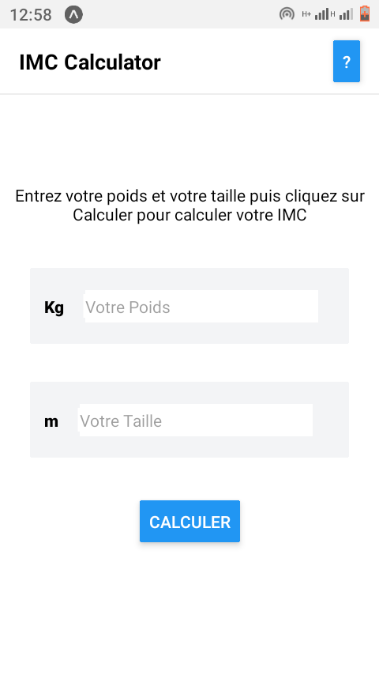
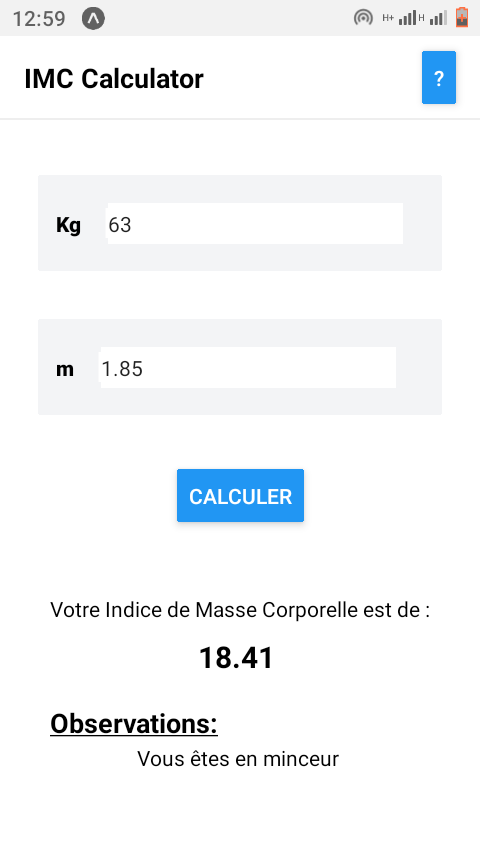

# BMI Calculator 📱

This mobile application helps you calculate your Body Mass Index (BMI) easily and quickly using React Native Expo and NativeWind for a sleek and responsive design.

## Table of Contents

- [Introduction](#introduction)
- [What is IMC?](#what-is-imc)
- [Features](#features)
- [Installation](#installation)
- [Usage](#usage)
- [Screenshots](#screenshots)
- [Technologies](#technologies)
- [Contributing](#contributing)
- [License](#license)
- [Contact](#contact)

## Introduction

The IMC Calculator is a simple and efficient tool designed to help users monitor their body mass index (BMI). The BMI is a useful indicator of whether an individual has a healthy body weight for a given height. This app is built with React Native using Expo for easy cross-platform development and NativeWind for beautiful, responsive designs.

## What is IMC?

IMC, or Índice de Massa Corporal (Body Mass Index - BMI), is a value derived from the mass (weight) and height of a person. The BMI is defined as the body mass divided by the square of the body height and is universally expressed in units of kg/m², resulting from mass in kilograms and height in meters.
[IMC on Wikipedia](https://fr.wikipedia.org/wiki/Indice_de_masse_corporelle#:~:text=L'indice%20de%20masse%20corporelle,appel%C3%A9%20l'indice%20de%20Quetelet.)

### BMI Categories:

- **Underweight**: BMI < 18.5
- **Normal weight**: BMI 18.5–24.9
- **Overweight**: BMI 25–29.9
- **Obesity**: BMI ≥ 30

## Features

- **Instant BMI Calculation**: Enter your weight and height to get your BMI instantly.
- **Responsive Design**: Smooth and adaptive UI designed with NativeWind.
- **Health Tips**: Get basic tips based on your BMI category.
- **Cross-Platform**: Available on both Android and iOS.

## Installation

To test it in your mobile app, you can download it troughout this link: [Download Here](https://expo.dev/artifacts/eas/pkkRzBZ5w1Goj6RPiwjy71.apk)

To run this project locally, follow these steps:

1. **Clone the repository**:
   ```bash
   git clone https://github.com/OumarouSandaSouley/imc-calculator-react-native.git
   cd imc-calculator-react-native
   ```

2. **Install dependencies**:
   ```bash
   npm install
   ```

3. **Start the project**:
   ```bash
   npx expo start
   ```

## Usage

1. **Open the app**: Launch the app on your device or simulator.
2. **Enter your details**: Input your weight in kilograms and height in meters.
3. **Calculate**: Press the calculate button to see your BMI and category.
4. **Health Tips**: View personalized health tips based on your BMI result.

## Screenshots




## Technologies

- **React Native**: For building native apps using React.
- **Expo**: For a fast development process and easy build tools.
- **NativeWind**: For responsive and beautiful UI design.

## Contributing

I welcome contributions! Please follow these steps to contribute:

1. Fork the repository.
2. Create a new branch (`git checkout -b feature/your-feature`).
3. Make your changes.
4. Commit your changes (`git commit -m 'Add some feature'`).
5. Push to the branch (`git push origin feature/your-feature`).
6. Open a pull request.

## License

This project is licensed under the MIT License. See the [LICENSE](./LICENSE) file for details.

## Contact

Created by [Oumarou Sanda Souley](https://github.com/OumarouSandaSouley). Feel free to contact me!

